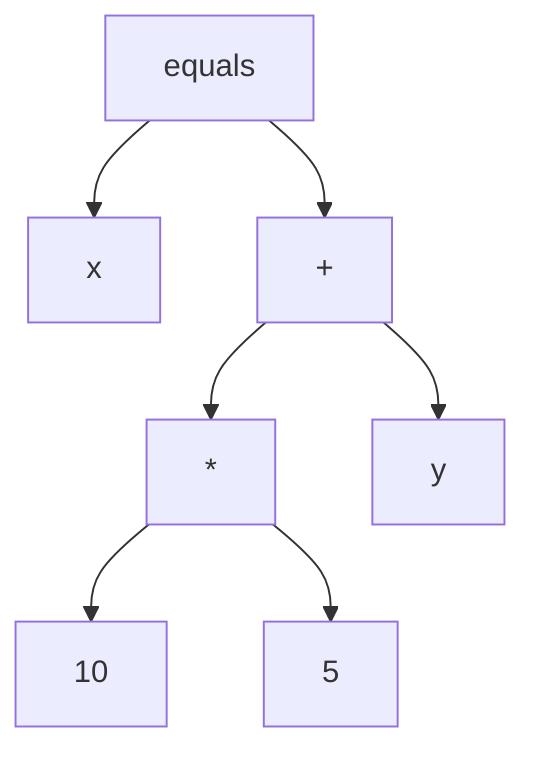
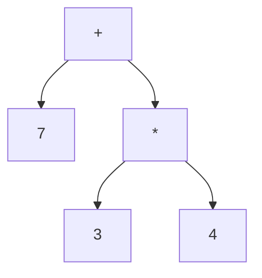

**Day One:**
- Youtube'd Go compiler
  - Learned where to locate the compiler code
    - *Understanding the Go Compiler - Jesus Espino*
  - Came across Go arenas experimental Garbage Collection system to see its relevance to what I'm doing. I don't think there is any relevance.
    - *Go 1.20 Memory Arenas Are AMAZING | Prime Reacts*
  - Compiler trying to get ASM output from Go compiler
    - is it necessary? ...right now?
  - Skip trying to get ASM output from Go compiler
  - Looking for in-depth knowledge of compiler
  - Read through the compiler code
    - `/src/cmd/compile/internal`
      - has a great README
      - parser and types are not really used by the compiler
        - WILL I NEED TO MODIFY THIS?
- Understand now that I need to adjust the PARSER!, because that deals with the syntax of a language, and whether it is correct or not, it also deals with creating an AST(Abstract Syntax Tree).
- Created a new repo `parserTrial` from a video.
- Found great videos: see references in NOTES.md.
  - *Building a Parser from Scratch - Dmitry Soshnikov*
  - *Recursive Descent Parsing - hhp3* 
- Some Examples from the videos:
> <Call name="print" args=["Hello"]/>

> x = 10 * 5 + y




- Only tokenizers use regular expressions(RegEx)
- Parsers user Backus-Naur Form
  - A notation to describe syntax and grammars of languages
- Program <br>
  * : StatementList
  * ;
* Statement
  * : BlockStatement
  * | IfStatement
  * | FunctionDeclaration
  * ...
  * ;

` How you define a function using Backus-Naur`
* FunctionDeclaration
  * : def Identifier (Arguments) BlockStatement
  * ;

`Using json notation for the AST`
EX: 
String: "7 + 3 * 4"

Now in JSON:
```json
{
    type: "BinaryExpression",
    operator: "+",
    left: {
        type: "NumericLiteral",
        value: 7
    },
    right: {
        type: "BinaryExpression",
        operator: "*",
        left: {
            type: "NumericLiteral",
            value: 3
        },
        right: {
            type: "NumericLiteral",
            value: 4
        }
    }
}
```
- Unfortunately, I am having a lot of trouble getting my go to compile. 
- Go won't install any tools I need to compile properly, keep getting errors.
- Took a look through the `src/cmd/compile/internal/syntax`, where the parser is. I now know that this is where I need to make changes.
- I also need to really understand it more.
- I'm still looking for what other changes I may need to make.
- It's looking pretty good with the progress I've made so far.
- Go has excellent documentation.

### GOALS:
- Finish videos so I have a better understanding and squeeze out any knowledge I can get from them.
- Read through and REALLY UNDERSTAND the parser.
- Make small changes to the parser.
- Create a small test program and see if I can get it to just not throw errors when adding new syntax.
